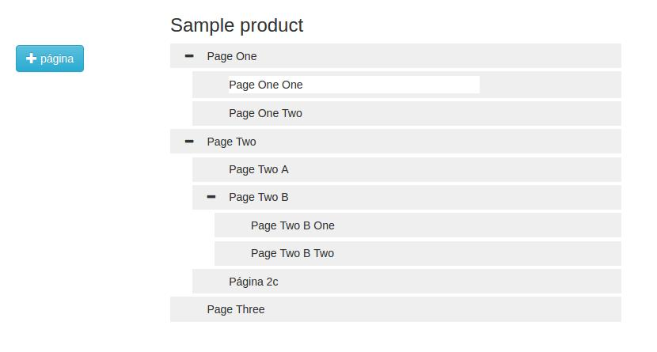

# Evoluttree

A ReactJs based, drag and drop, tree-structured content management system.

Built on top of **ReactJs**, **Redux**, **Immutable**, **React dnd** and other wonders
of javascript's world.

## Getting started

### Installation and usage

```
npm install evoluttree
```


```typescript
import * as React from 'react'
import * as ReactDOM from 'react-dom';

import { Evoluttree } from 'evoluttree'

// ---> general configuration for evoluttree
let myEvoluttreeConfig = {
    // --> called when anyone do changes in content thru frontend
    hookActionsToExternal: function(action) {
        console.log(' EXTERNAL HOOK action (redux style) = %o CALLED', action);
    },

    // --> this callback is invoked when one starts editing a page
    onStartEditPageBody: function(elementId, pageInfo) {
        console.log(' Started editing page dom elementId = %s  PageInfo = %o', elementId, pageInfo );

        // do what you want
        // ...
    }
};

// ---> the product being edited
let myEditingProduct = {
        general: {
            id: 123,
            title: 'Sample product'
        },
        pages: [
            {
                id: 1,
                title: 'Page One',
                pages: [
                    {id: 11,
                        title: 'Page One One'
                    }
                ]
            },
            {
                id: 2,
                title: 'Page Two',
                pages: [
                    {id: 21,
                        title: 'Page Two A'
                    }
                ]
            },
        ]
    }

class MyWebsiteManager extends React.Component<{}, {}> {
    constructor(props) {
        super(props);
    }
    render() {
        return(
            <div>
                <h1>My incredible website</h1>

                < Evoluttree config={myEvoluttreeConfig} editingProduct={myEditingProduct}/>
            </div>
        );
    }
}

ReactDOM.render(
    (
        <MyWebsiteManager />
    ),
    document.getElementById('content')
);
```

If everything is alright you gonna get something like this:



You can drag and drop the pages, sort them as your want, add new pages, edit page and product
titles (just click over them), edit and delete pages.

New features comming soon.

### For developers

- run a **webpack-dev-server** and get the page updated as long you update the code

- [Check out developers notes](./docs/developers.MD)


## Some definitions

* **product** a container for diferent types of contents like a main title, description and tree
of nested pages.
* **page** a node in content hierarchy. It contains a title and a body and can have a list
of children pages.

## API documentation

Evoluttree allows to change its state. Checkout out our [API](./docs/API.MD)


## Recipes

- [Integrating with CkEditor](./docs/ckeditor.MD)
- [Deploying](./docs/deploying.MD)


## Contributing

Want to get involved? Welcome!

- [Developers notes](./docs/developers.MD)


